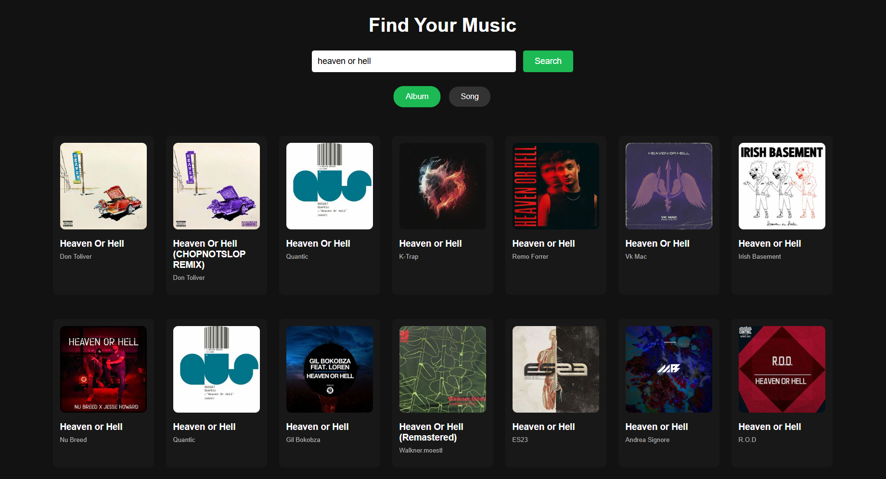

# Mini-Spotify 🎵

A lightweight music streaming application built with vanilla JavaScript that uses the Deezer API to search and play music, albums, and tracks.



## Features

- 🔍 Search for songs and albums
- 🎵 Play song previews (30-second clips)
- 💿 Browse full albums and their track listings
- 🎚️ Playback controls (play/pause, next/previous, volume)
- 🔄 Shuffle and repeat modes
- 📱 Responsive design for desktop and mobile devices

## Technologies Used

- HTML5
- CSS3
- JavaScript (ES6+)
- [Deezer API](https://developers.deezer.com/api)
- [Color Thief](https://lokeshdhakar.com/projects/color-thief/) for dynamic album page background colors
- [Font Awesome](https://fontawesome.com) for icons

## Setup Instructions

### Prerequisites

- [Node.js](https://nodejs.org/) (for the CORS proxy server)
- Modern web browser (Chrome, Firefox, Safari, Edge)

### Installation Steps

1. **Clone the repository**
   ```bash
   git clone https://github.com/ZiadHesham225/Mini-Spotify.git
   ```
2. **Navigate to Project Directory**
   ```bash
   cd Mini-Spotify\proxy server
   ```
3. **Start the CORS proxy server**
   ```bash
   node server.js
   ```
   The server will start at http://localhost:8080
4. **Serve the application** You can use any static file server. For example, with Live Server in VS Code, right-click on index.html and select "Open with Live Server".
5. **Access the application** Open your browser and navigate to:
  ```bash
  http://localhost:5500
  ```
## How It Works

1. **Search**: Users can search for songs or albums using the Deezer API
2. **Album View**: Clicking on an album shows detailed album information and track listing
3. **Playback**: Users can play 30-second previews of tracks provided by Deezer
4. **CORS Handling**: All API requests are routed through a local CORS proxy to avoid cross-origin issues
